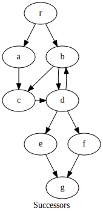
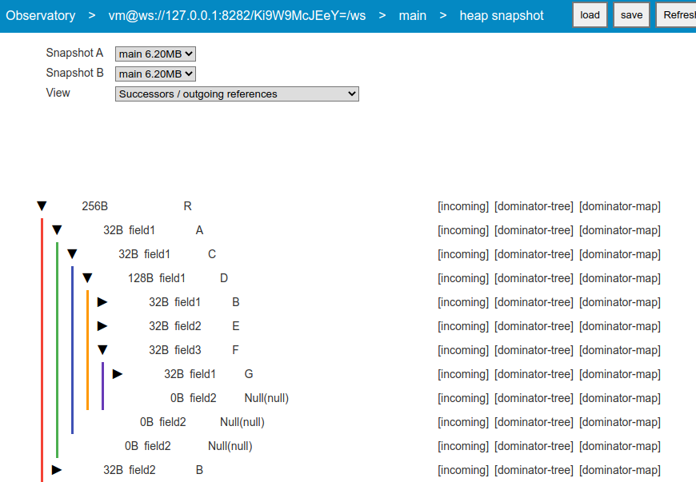
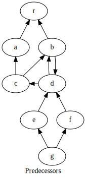
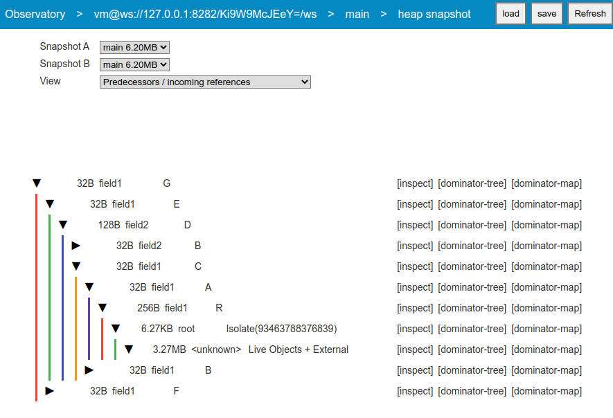
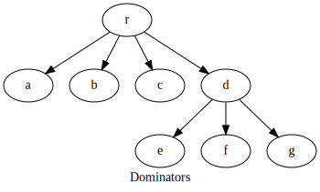
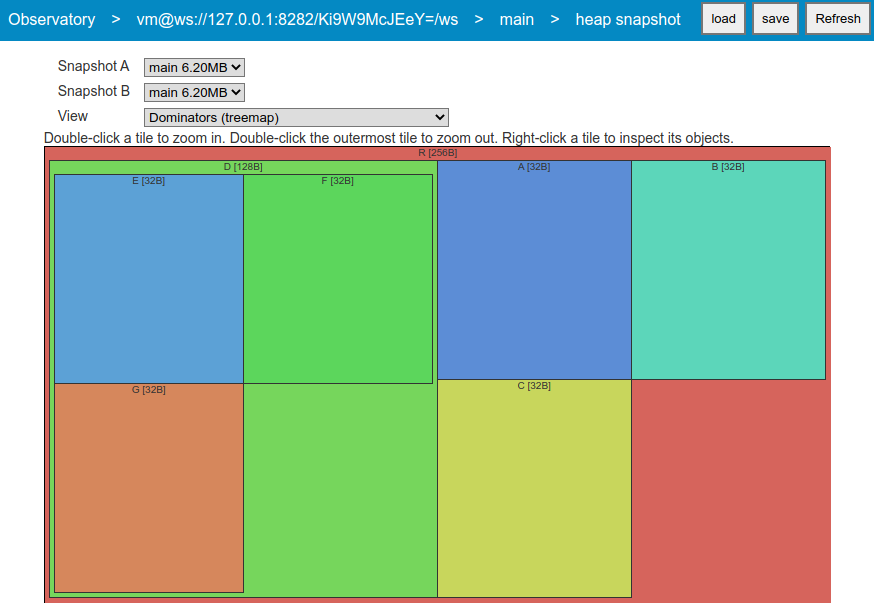

# Heap snapshots

The [VM service protocol](../vm/service/service.md) provides access to _heap snapshots_, a description of all the objects and references in the heap at some point in time. Tools such as Observatory provide analysis and visualization of these snapshots to help developers understand the memory usage of their applications.

* [Concepts](#concepts)
* [Advice](#concepts)

## Concepts

```dart
class R {
  var field1;
  var field2;
}
class A {
  var field1;
  var field2;
}
class B {
  var field1;
  var field2;
}
class C {
  var field1;
  var field2;
}
class D {
  var field1;
  var field2;
  var field3;
}
class E {
  var field1;
  var field2;
}
class F {
  var field1;
  var field2;
}
class G {
  var field1;
  var field2;
}

var root;

main() {
    var r = new R();
    var a = new A();
    var b = new B();
    var c = new C();
    var d = new D();
    var e = new E();
    var f = new F();
    var g = new G();
    r.field1 = a;
    r.field2 = b;
    a.field1 = c;
    b.field1 = c;
    b.field2 = d;
    c.field1 = d;
    d.field1 = b;
    d.field2 = e;
    d.field3 = f;
    e.field1 = g;
    f.field1 = g;
    root = r;
}
```

### Successors

The successors of an object are the objects it directly references, such as through an instance variable or an array element.




### Predecessors

The predecessors of an object are the objects that directly reference it.




### Dominators

In a heap [dominator](https://en.wikipedia.org/wiki/Dominator_(graph_theory)) tree, an object X is a parent of object Y if every path from the root to Y goes through X. This allows you to find "choke points" that are holding onto a lot of memory. If an object becomes garbage, all its children in the dominator tree become garbage as well.




### Owners

An object X is said to "own" object Y if X is the only object that references Y, or X owns the only object that references Y. In particular, objects "own" the space of any unshared lists or maps they reference.


## Advice
